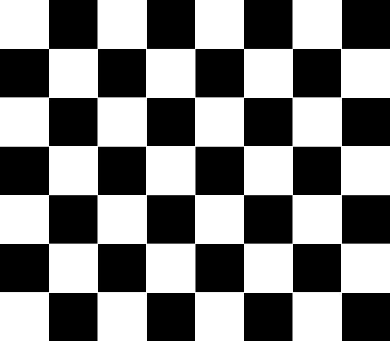

# Camera Calibration for AprilTag Pose Estimation

## Purpose of Camera Calibration

Camera calibration is necessary to obtain accurate intrinsic parameters of the camera and correct lens distortion. These parameters are required to:

- Remove image distortion caused by the lens
- Provide accurate pose estimation of AprilTags
- Ensure reliable spatial perception

Without calibration, pose estimation results (translation and rotation) could be incorrect due to inaccurate camera modeling.

## What You Need

- The camera mounted on the BlueROV2
- A computer connected to the camera (via USB or IP stream)
- A printed checkerboard calibration target as shown below (this one is 7×6 inner corners, 25 mm square size)
 

## ROS 2–Based Camera Calibration

### Prerequisites

- Make sure you have already completed all the steps until Module 2, section 2.3 (Installing Rosmav)
- Confirm that the camera is publishing to `/bluerov2/camera`
- Install the `camera_calibration` package:

   ```
   sudo apt install ros-jazzy-camera-calibration
   ```
### Step-by-Step Instructions

1. **Prepare the calibration target**

   Print a checkerboard pattern with known dimensions. We have a 7×6 checkerboard with 25 mm squares. 
   Glue it to a stiff backing (like foam board) to keep it flat and rigid during calibration.

2. **Start the camera node**

   Launch the camera driver:

   ```
   ros2 run usb_cam usb_cam_node_exe
   ```

   Verify the image stream:

   ```
   ros2 topic list
   ros2 topic echo /bluerov2/camera
   ```

3. **Run the camera calibration tool**

   Launch the calibration:

   ```
   ros2 run camera_calibration cameracalibrator \
     --size 7x6 \
     --square 0.025 \
     --camera_name blue_rov_camera \
     --topic /bluerov2/camera
   ```

   :::tip
   - `--size`: Number of inner corners (columns × rows)
   - `--square`: Length of one square in meters (e.g., 0.025)
   - `--camera_name`: A label for your camera
   - `--topic`: The camera image topic
   :::
   
4. **Move the checkerboard in front of the camera**

   Slowly move and tilt the board in front of the camera, covering various parts of the image and varying orientations.

   Once enough good images are collected, the `cameracalibrator` will compute calibration parameters.

5. **Save the calibration file**

   The `cameracalibrator` will save a `.yaml` file containing:

   - `camera_matrix` (K)
   - `distortion_coefficients` (D)
   - `rectification_matrix` (R)
   - `projection_matrix` (P)
  
   This file is used by ROS nodes to undistort images and accurately estimate poses.

  :::note
   Since you’re running the tool over SSH, once calibration completes, the tool will print a prompt like:

   ```
   Save to where? [blue_rov_camera.yaml]:
   ```

   At this point:

   - Press **Enter** to save the file in your current working directory with the default name `blue_rov_camera.yaml`.
   - Or, type a **full path** to save it somewhere specific, for example:

   ```
   /your_full_path/blue_rov_camera.yaml
   ```
   :::

   :::warning
   Make sure to note the full path, as you'll need it later when using the calibration with your AprilTag detector.
   
   If you saved it with the default name and don't know the path:

   ```
   find ~ -name "blue_rov_camera.yaml"
   ```
   :::


### Exmaple of using the calibration in your AprilTag detector 

   We will be using the [Python bindings for the AprilTags 3 library by Duckietown](https://github.com/duckietown/lib-dt-apriltags) (`dt-apriltags`), you'll need to manually load the `.yaml` calibration file and pass the camera parameters to the detector for pose estimation.

   Now that the calibration file is saved, follow these steps in the Jupyter notebook:

#### Load the calibration from the .yaml file:

   ```python
   import yaml
   import numpy as np

   # Load calibration file
   with open("/full_path_to/blue_rov_camera.yaml", 'r') as f: # replace with your saved path from previous step
      calib_data = yaml.safe_load(f)

   # Extract intrinsic parameters
   K = np.array(calib_data["camera_matrix"]["data"]).reshape((3, 3))  # fx, 0, cx, 0, fy, cy, 0, 0, 1
   D = np.array(calib_data["distortion_coefficients"]["data"])        # [k1, k2, p1, p2, k3]

   # Optionally print to verify
   print("Camera matrix:\n", K)
   print("Distortion coefficients:\n", D)
   ```

#### Undistort the image before detection:

   Use OpenCV to undistort the image before passing it to the detector:

   ```python
   import cv2

   # Load the image previously used 
   img = cv2.imread("test_image.png")

   # Get optimal new camera matrix
   h, w = img.shape[:2]
   new_K, _ = cv2.getOptimalNewCameraMatrix(K, D, (w, h), 1, (w, h))

   # Undistort the image
   undistorted = cv2.undistort(img, K, D, None, new_K)
   ```

#### Run AprilTag detection with camera intrinsics:

   ```python
   from dt_apriltags import Detector

   # Initialize detector
   detector = Detector(families='tag36h11')

   # Convert to grayscale
   gray = cv2.cvtColor(undistorted, cv2.COLOR_BGR2GRAY)

   # Camera intrinsics for pose estimation
   fx = K[0, 0]
   fy = K[1, 1]
   cx = K[0, 2]
   cy = K[1, 2]

   # Run detection 
   tags = detector.detect(
      gray,
      estimate_tag_pose=True,
      camera_params=(fx, fy, cx, cy),
      tag_size=0.1 # in meters
   )
   ```
   :::warning
   When testing on your BlueROV2, you need to adjust `tag_size` parameter to the **real-world edge length of the black square of the tag**, measured in **meters**.
   :::
#### Print or use the detection results:

   ```python
   for tag in tags:
      print(f"Detected tag ID: {tag.tag_id}")
      print("Translation (t):", tag.pose_t.flatten())
      print("Rotation matrix (R):\n", tag.pose_R)
   ```

   This gives you the full **6DOF pose** (6 Degrees of Freedom), which is the translation and rotation of each detected tag, based on your calibrated camera.

:::tip
   If you’re processing video or a live camera feed, repeat steps 2-4 on each frame.
:::

## Conclusion

   The pose you get from the AprilTag detection (`pose_t` and `pose_R`) represents the full **6 Degrees of Freedom (6DOF)** pose of the detected tag relative to the camera. This includes:

   - **3D Position**: X (left/right), Y (up/down), Z (forward/back)
   - **3D Orientation**: Roll (rotation around X), Pitch (around Y), Yaw (around Z)

   This 6DOF pose is useful because if the AprilTag is placed at a known, fixed location in the environment (e.g., on a wall or floor), then the pose result tells you the **location and orientation of the BlueROV relative to that tag**.

   You can use this information for:

   - **Real-time localization** of the ROV during movement
   - **Maintaining position** near a tag (station-keeping)
   - **Navigating** toward or around specific AprilTags
   - **Feeding position data** into a state estimator alongside IMU or depth sensor readings

   The camera calibration parameters are essential for making pose estimation work correctly. Specifically, the `fx`, `fy`, `cx`, and `cy` values from the camera matrix `K` (obtained from the calibration file) are passed to the AprilTag detector when calling the `detect()` method:

   ```python
   tags = detector.detect(
      gray,
      estimate_tag_pose=True,
      camera_params=(fx, fy, cx, cy),
      tag_size=0.1  # in meters
   )
   ```

   These parameters define the camera’s focal lengths and optical center, which the detector uses to correctly map the 2D tag corners in the image to a 3D pose in space.
   Without them, the detector can still find tags, but it cannot calculate the pose relative to the camera; which is critical for localization and control.


<!-- Draft section, Not complete

## Option 2: OpenCV-Based Camera Calibration (No ROS) 

### Prerequisites

- Python 3 with OpenCV installed 

```
pip install opencv-python
```
- Camera accessible via `/dev/video*`, USB, or IP stream
- Same printed checkerboard pattern used above

### Python Calibration Script

```python
import cv2
import numpy as np

CHECKERBOARD = (7, 6)
square_size = 0.025  # meters

objp = np.zeros((CHECKERBOARD[0]*CHECKERBOARD[1], 3), np.float32)
objp[:, :2] = np.mgrid[0:CHECKERBOARD[0], 0:CHECKERBOARD[1]].T.reshape(-1, 2)
objp *= square_size

objpoints = []
imgpoints = []

cap = cv2.VideoCapture(0)  # Adjust to match your camera

print("[INFO] Press 's' to save frame, 'q' to quit...")

while True:
    ret, frame = cap.read()
    if not ret:
        break
    gray = cv2.cvtColor(frame, cv2.COLOR_BGR2GRAY)
    cv2.imshow("Calibration", frame)

    key = cv2.waitKey(1) & 0xFF
    if key == ord('s'):
        ret, corners = cv2.findChessboardCorners(gray, CHECKERBOARD, None)
        if ret:
            objpoints.append(objp)
            imgpoints.append(corners)
            cv2.drawChessboardCorners(frame, CHECKERBOARD, corners, ret)
            print("[INFO] Frame saved.")
        else:
            print("[WARN] Checkerboard not detected.")
    elif key == ord('q'):
        break

cap.release()
cv2.destroyAllWindows()

ret, K, D, R, T = cv2.calibrateCamera(objpoints, imgpoints, gray.shape[::-1], None, None)

print("Camera matrix (K):\n", K)
print("Distortion coefficients (D):\n", D)

np.savez("blue_rov_camera_calib.npz", K=K, D=D, R=R, T=T)
```

### Using the Calibration Output

You can load this file in any OpenCV or AprilTag-based pipeline:

```python
calib = np.load("blue_rov_camera_calib.npz")
K = calib["K"]
D = calib["D"]
```

You can then undistort images using:

```python
undistorted = cv2.undistort(image, K, D)
```

Or pass the calibration directly to a pose estimation function (such as in OpenCV’s ArUco or AprilTag libraries).

-->